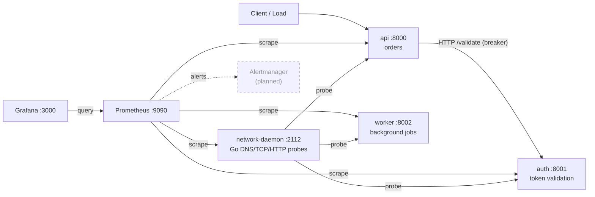

# AutoSRE

[](https://github.com/Raynzler/Auto-SRE/actions/workflows/ci.yml)
[](LICENSE)


[](https://docs.astral.sh/ruff/)


**AutoSRE is a production-style Site Reliability Engineering platform you can run
on your laptop.** It's a small distributed system — three FastAPI services plus a
Go network daemon — instrumented end-to-end with RED metrics, SLOs and error
budgets, resilience patterns (circuit breakers, rate limiting, graceful
degradation), and a controlled chaos-engineering framework, all wired into
Prometheus and Grafana.

Its guiding principle: **observe, measure, and notify — never auto-remediate.**
Failures are made visible and tracked; humans act on them using the
[runbooks](docs/runbooks/). It exists to *demonstrate* how reliability is
engineered and operated, not to hide failure behind automation.

🌐 **Landing page:** [auto-sre.vercel.app](https://auto-sre.vercel.app/)

---

## Features

### ✅ Implemented
- **Multi-service architecture** — `api`, `auth`, and `worker`, all built on one
  shared platform library (`autosre_shared`); no duplicated middleware.
- **RED observability** — Rate, Errors, Duration instrumented globally; SLO-aligned
  latency histograms; per-service separation via the Prometheus `job` label.
- **SLOs & error budgets** — recording rules for availability, p50/p95/p99 latency,
  error-budget remaining, and multi-window burn rate.
- **Symptom-based alerting** — 7 alert rules, each with severity, summary,
  description, and a runbook link.
- **Chaos engineering** — per-service latency / error / CPU / memory injection;
  bounded, reversible, deterministic, and lock-out-safe.
- **Resilience patterns** — a reusable circuit breaker (CLOSED/OPEN/HALF_OPEN) and
  a token-bucket rate limiter, behind storage-agnostic interfaces.
- **Failure persistence** — chaos, breaker, and rate-limit events appended as JSONL
  via a replaceable `FailureStore`.
- **Go network daemon** — DNS / TCP / HTTP probes exporting `network_*` metrics.
- **Grafana dashboards** — RED, Reliability/SLO, Chaos, and Incident, auto-provisioned.
- **Production hardening** — non-root containers, read-only filesystems, resource
  limits, health probes, graceful shutdown, request/correlation IDs, security
  headers, strict input validation.
- **Testing & CI** — 58-test pytest suite (93% of the shared library) and a CI
  pipeline (lint, types, tests, security scan, dependency audit, Docker/Prometheus/
  Grafana validation, auto-tagged releases).

### 🚧 In progress
- **Alertmanager routing** — alert *rules* exist and fire; notification routing is
  stubbed (commented) in `prometheus.yml`. Alerts are currently viewed at the
  Prometheus `/alerts` UI.
- **Event-timeline visualization** — surfacing the `/failures` JSONL feed in Grafana
  (via Loki or a JSON datasource) for an annotated incident timeline.

### 🗺️ Roadmap
See [Future Roadmap](#future-roadmap). The storage and client seams
(`FailureStore`, `BreakerStore`, `BucketStore`, `ServiceClient`) already exist so
those land without refactoring business logic.

---

## Architecture



| Component | Role |
|-----------|------|
| **API service** | User-facing order endpoint. Validates tokens by calling Auth through a `ServiceClient`, guarded by a circuit breaker (open → fast `503`). The canonical RED service. |
| **Worker service** | Background job processor simulating async task execution; emits job throughput/duration metrics and is chaos-aware (latency/error injection affects jobs). |
| **Auth service** | Simulated token validation against a downstream identity provider with artificial latency; protected by its own circuit breaker and rate limited. |
| **Go network daemon** | Independent vantage point: probes DNS/TCP/HTTP reachability and latency of every service and exports `network_*` metrics. Distinguishes "network broken" from "app broken". |
| **Prometheus** | Scrapes every service (`job` per service), evaluates recording rules (SLIs, SLO/error budget) and symptom-based alert rules. 15s scrape/eval. |
| **Grafana** | Auto-provisioned datasource + four dashboards (RED, Reliability, Chaos, Incident) with a `$job` service selector. |
| **Alertmanager** | *Planned.* Notification routing for the alerts Prometheus already fires (stub config present). |
| **Chaos engineering** | Per-service `/chaos/*` endpoints inject bounded failure so the observability stack has something real to detect. |
| **Observability** | RED metrics + structured JSON logging with request/correlation IDs propagated across services. |
| **Circuit breakers** | Reusable breaker guarding cross-service dependencies; rejects fast when a dependency is unhealthy, recovers via HALF_OPEN. |
| **Rate limiting** | Per-client token bucket as middleware; returns `429` with `Retry-After`. |

Full diagrams (request / metrics / alert / failure-injection / dependency flows)
and the rationale for every service, metric, and alert are in
[docs/architecture](docs/architecture/).

---

## Technology stack

| Category | Technologies |
|----------|-------------|
| **Backend** | Python 3.12+, FastAPI, Pydantic, uvicorn |
| **Infrastructure** | Docker, Docker Compose |
| **Observability** | Prometheus, Grafana (Alertmanager — planned) |
| **Networking** | Go 1.23 network daemon (`net/http`, `log/slog`, `prometheus/client_golang`) |
| **Testing** | pytest, pytest-cov, coverage |
| **CI/CD** | GitHub Actions, Ruff, mypy, Bandit, pip-audit, govulncheck, Trivy, promtool |
| **Documentation** | Markdown, Mermaid, Architecture Decision Records |

---

## Getting started

### Prerequisites
- **Docker** with Compose. That's all you need to run the whole stack and tests.
- *(Optional)* Python 3.12+ and Go 1.23 for local development.

### Installation
```bash
git clone https://github.com/Raynzler/Auto-SRE.git
cd Auto-SRE
```

### Docker setup & running locally
```bash
make up      # build images and start all services (detached)
make ps      # check health
```

| Service | URL |
|---------|-----|
| API docs (Swagger) | http://localhost:8000/docs |
| Prometheus (+ `/alerts`) | http://localhost:9090 |
| Grafana (admin / admin) | http://localhost:3000 |
| Network daemon metrics | http://localhost:2112/metrics |

### Viewing dashboards
```bash
make dashboards   # opens Grafana
```
Then open **RED**, **Reliability & SLO**, **Chaos Engineering**, or **Incident
Response** (use the `$job` selector to switch services).

### Running chaos experiments
```bash
make chaos        # inject a demo scenario across services
make chaos-reset  # clear all chaos
```
Or drive endpoints directly — see [Chaos Engineering](#chaos-engineering).

### Running tests
```bash
make test         # full suite in a container (no local Python needed)
make test-local   # locally (needs: pip install -r requirements-dev.txt)
```

### Stopping services
```bash
make down         # stop and remove containers (keeps data volumes)
make clean        # also remove volumes and local artifacts
```

---

## Project structure

```
api/            FastAPI order service (calls auth, breaker-guarded)
auth/           Token-validation service (breaker + rate limit)
worker/         Background job processor (chaos-aware)
shared/         autosre_shared — the platform library every service imports
go-daemon/      Go network observability daemon (cmd / internal / pkg / config)
observability/  prometheus/ (rules, alerts) + grafana/ (dashboards, provisioning)
tests/          unit, integration, chaos, metrics, alert, health, hardening
docs/           architecture, ADRs, runbooks, postmortems, operations, guides, design
.github/        CI pipeline
Makefile        one-command developer workflow
```

---

## Metrics

Every service exposes Prometheus metrics at `/metrics`. Application metrics
(standard Go runtime / `process_*` / `python` client metrics are also exported):

### HTTP / RED (all services)
| Metric | Type | Labels | Meaning |
|--------|------|--------|---------|
| `http_requests_total` | counter | method, endpoint, status | Request count (Rate + Errors via `status`) |
| `http_request_duration_seconds` | histogram | method, endpoint | Request latency (Duration); SLO-aligned buckets |
| `http_requests_in_progress` | gauge | method | In-flight requests (saturation) |
| `http_exceptions_total` | counter | method, endpoint, exception_type | Unhandled exceptions by class |
| `service_up` | gauge | — | 1 = up, 0 = graceful shutdown |

### Chaos (all services)
| Metric | Type | Labels | Meaning |
|--------|------|--------|---------|
| `chaos_active` | gauge | type | 1 if a chaos mode is active |
| `chaos_events_total` | counter | type, action | Chaos control events (enable/disable/trigger/reset) |
| `chaos_latency_seconds` | histogram | — | Latency injected into requests |
| `chaos_error_injections_total` | counter | — | Injected HTTP 500s |

### Resilience (api, auth)
| Metric | Type | Labels | Meaning |
|--------|------|--------|---------|
| `circuit_breaker_state` | gauge | name | 0=closed, 1=open, 2=half_open |
| `circuit_breaker_open_total` | counter | name | Transitions to OPEN |
| `circuit_breaker_rejections_total` | counter | name | Calls rejected while OPEN |
| `rate_limit_requests_total` | counter | — | Requests evaluated by the limiter |
| `rate_limit_rejections_total` | counter | — | Requests rejected (429) |

### Domain
| Metric | Type | Labels | Service |
|--------|------|--------|---------|
| `auth_token_validations_total` | counter | result | auth |
| `worker_jobs_processed_total` | counter | status | worker |
| `worker_job_duration_seconds` | histogram | — | worker |

### Network daemon (`:2112`)
| Metric | Type | Labels |
|--------|------|--------|
| `network_latency_seconds` | histogram | target, check |
| `network_requests_total` | counter | target, check |
| `network_failures_total` | counter | target, check |
| `network_dns_lookup_seconds` | histogram | target |
| `network_tcp_connections_total` | counter | target |
| `network_timeouts_total` | counter | target, check |

**Recording rules** (Prometheus, `api`-scoped): `api:request_rate`,
`api:error_rate`, `api:latency:p50|p95|p99`, `api:availability`,
`api:saturation:in_flight`, `api:slo_target`, `api:error_budget_remaining`,
`api:error_budget_burn_rate:5m|1h`.

---

## Chaos Engineering

> ⚠️ **For testing only.** These endpoints intentionally degrade the service.
> They are **unauthenticated** and assume a trusted, network-isolated host
> (local/demo). Never expose them on an untrusted network — gate behind auth or
> disable them first. Every mode is bounded and reversible (`/chaos/reset`).

Each service mounts the same router (`api:8000`, `auth:8001`, `worker:8002`):

| Endpoint | Body | Purpose |
|----------|------|---------|
| `POST /chaos/latency` | `{enable, delay_seconds}` | Inject fixed latency into every request (≤ 10s). Tests latency SLOs/alerts. |
| `POST /chaos/errors` | `{enable, rate_percent}` | Inject HTTP 500s at a deterministic, evenly-spread rate. Tests error-rate alerts and breakers. |
| `POST /chaos/cpu` | `{duration_seconds}` | Run a bounded CPU burn (≤ 30s) in the background. Tests saturation. |
| `POST /chaos/memory` | `{size_mb, hold_seconds}` | Allocate and hold memory (≤ 256 MB, ≤ 60s). Tests memory pressure. |
| `POST /chaos/reset` | — | Disable all chaos and free held memory. |
| `GET /chaos/status` | — | Current chaos state for the service. |

Control/observability paths (`/health`, `/ready`, `/metrics`, `/chaos/*`, etc.)
are never injected, so you can always turn chaos off. Worker jobs honor
latency/error injection too. Reproducible incident walkthroughs using these
endpoints are documented in the [postmortems](docs/postmortems/).

---

## Reliability

- **SLIs** — availability (non-5xx ratio), latency (p95), error rate, per-service
  via `job`.
- **SLOs** — availability **99.9%** (30d); API latency **p95 < 500ms** (alert at
  750ms). Defined as recording rules so dashboards and alerts read one source.
- **Error budgets** — `api:error_budget_remaining` plus 5m/1h **burn-rate** series;
  a multi-window fast-burn alert (14.4×) pages only on a real, sustained burn.
- **Circuit breakers** — guard api→auth and auth→identity-provider. CLOSED → OPEN
  at the failure threshold, fast-fail while OPEN, HALF_OPEN trial, then CLOSED.
  State is behind a `BreakerStore` interface (Redis-ready).
- **Rate limiting** — per-client token bucket (default 10 rps / 20 burst), `429` +
  `Retry-After`, behind a `BucketStore` interface.
- **Alerting** — symptom-based: `HighErrorRate`, `HighLatencyP95`, `ServiceDown`,
  `ErrorBudgetFastBurn`, `CircuitBreakerOpen`, `RateLimitingSpike`,
  `ChaosModeActive`. (Routing via Alertmanager is planned; rules fire today and
  are visible at Prometheus `/alerts`.)
- **Runbooks** — operator response for every alert (operator actions only):
  [docs/runbooks](docs/runbooks/).
- **Incident postmortems** — three blameless, reproducible chaos-driven incidents:
  [docs/postmortems](docs/postmortems/).

---

## Screenshots

> 📸 Best seen live. Run `make up && make chaos`, then capture the dashboards.
> [docs/media/](docs/media/) lists exactly which views to grab and the filenames
> the README expects. _(Placeholders below — add the images to enable them.)_

<!--  -->
<!--  -->
<!--  -->

The architecture diagram renders inline above (Mermaid); the full set is in
[docs/architecture](docs/architecture/).

---

## Development

```bash
pip install -r requirements-dev.txt   # shared (editable) + test/lint tools
```

| Task | Command |
|------|---------|
| **Testing** | `make test` (Docker) or `make test-local` (pytest + coverage → `htmlcov/`) |
| **Formatting** | `make fmt` (Ruff format) |
| **Linting** | `make lint` (Ruff check + format check) |
| **Type checking** | `make typecheck` (mypy) |
| **CI** | [`.github/workflows/ci.yml`](.github/workflows/ci.yml): lint, types, tests, Bandit + Trivy security scan, pip-audit + govulncheck, Docker build, Prometheus/Grafana validation, and an auto-tagged release on `master` |

**Contribution workflow:** run `make lint && make typecheck && make test`, then
open a PR. Conventions and details are in [CONTRIBUTING.md](CONTRIBUTING.md); a
deeper local walkthrough is in [docs/development.md](docs/development.md).

---

## Future Roadmap

Long-term vision — **planned, not yet implemented.** The relevant interfaces
already exist so these integrate without rewriting business logic:

- **PostgreSQL** — durable persistence behind the `FailureStore` interface.
- **Redis** — shared circuit-breaker / rate-limiter state and a token cache
  (enabling correct multi-replica behavior and graceful auth degradation).
- **Kubernetes** — manifests/Helm as an alternative to Compose (without
  auto-healing, to preserve the observe-only charter).
- **OpenTelemetry & distributed tracing** — building on the existing
  request/correlation IDs for end-to-end spans.
- **Service mesh exploration** — evaluate mesh-level mTLS / traffic policy vs. the
  application-level resilience patterns.
- **Cloud deployment** — a reference deployment with managed Prometheus/Grafana.

See also [docs/operations.md](docs/operations.md) for known limitations and the
operational threat model.

---

## License

[MIT](LICENSE) © 2026 Hamza Shaikh — [@Raynzler](https://github.com/Raynzler)
