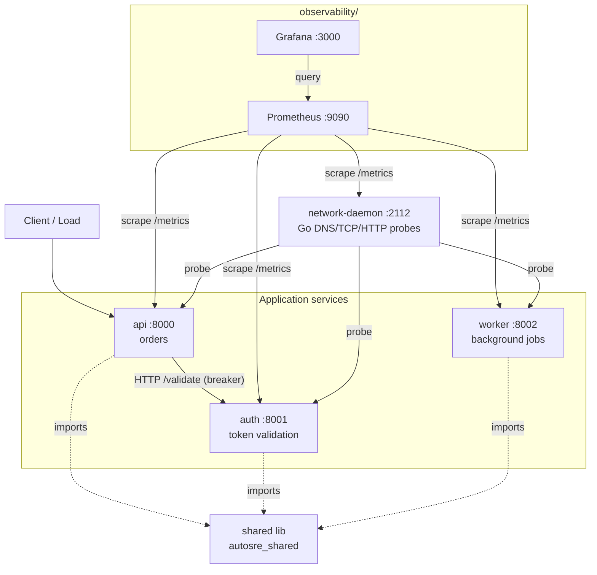
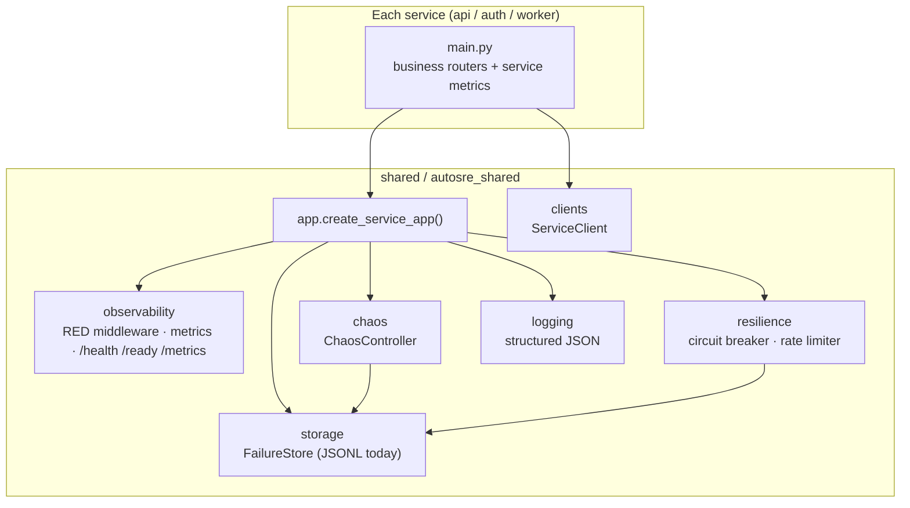
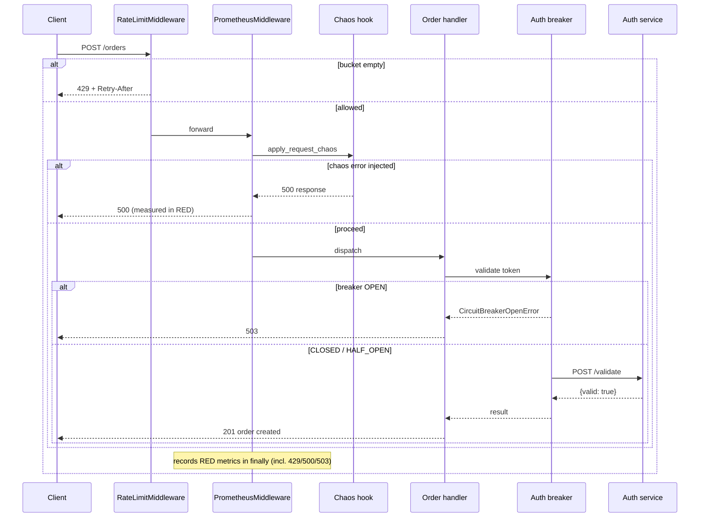
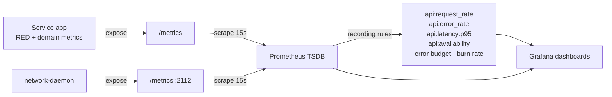
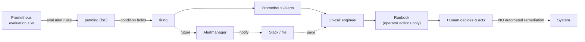
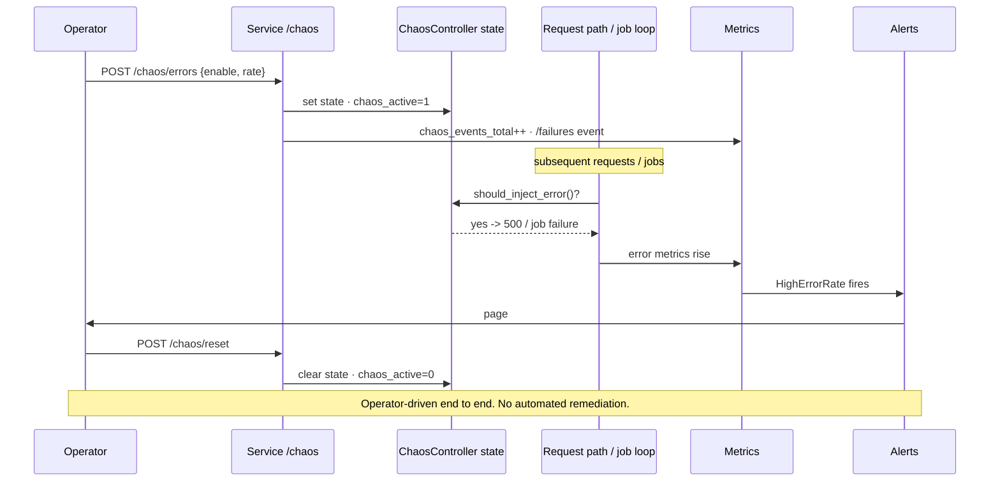
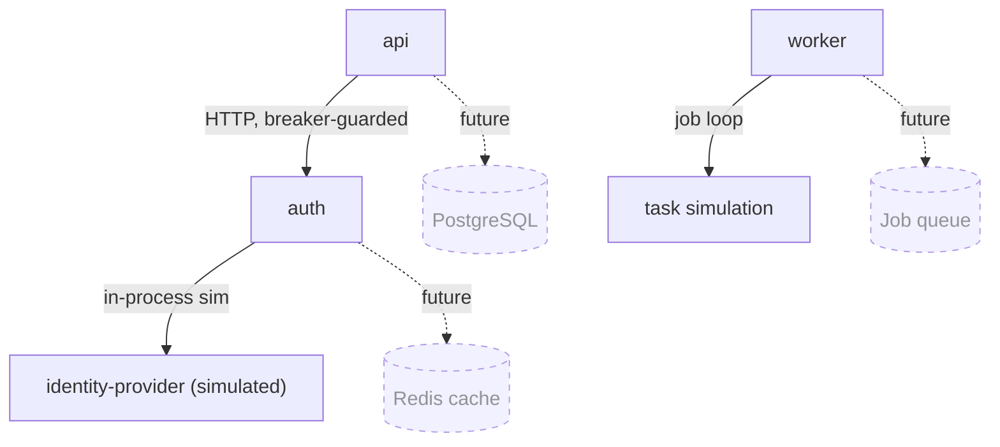

# AutoSRE Architecture

A production-style SRE platform for **observability, resilience, and controlled
failure injection**. AutoSRE deliberately performs **no automated remediation** —
it detects, measures, and notifies; humans decide and act.

- [Architecture overview](#architecture-overview)
- [Component diagram](#component-diagram)
- [Request flow](#request-flow)
- [Metrics flow](#metrics-flow)
- [Alert flow](#alert-flow)
- [Failure injection flow](#failure-injection-flow)
- [Dependency diagram](#dependency-diagram)
- [Why each service exists](#why-each-service-exists)
- [Why each metric exists](#why-each-metric-exists)
- [Why each alert exists](#why-each-alert-exists)
- [Architecture Decision Records](../adr/)

---

## Architecture overview

Three application services share one library (`autosre_shared`). A Go daemon
probes network reachability. Prometheus scrapes everything; Grafana visualizes.

---

## Component diagram

Each service file declares only its business routers; everything else comes from
the shared library via `create_service_app()`.

---

## Request flow

A request to `api` passes through the rate limiter, then the RED-instrumenting
Prometheus middleware (which also applies chaos), then the handler — which calls
`auth` through a circuit breaker.

---

## Metrics flow

Apps expose RED + domain metrics at `/metrics`. Prometheus scrapes, pre-computes
SLIs via recording rules, and Grafana queries both.

---

## Alert flow

Prometheus evaluates symptom-based rules. Firing alerts surface in the UI (and,
later, Alertmanager). **The loop ends at a human + a runbook — there is no path
that lets an alert act on the system automatically.**

---

## Failure injection flow

Chaos is operator-triggered and operator-cleared. It exists purely to give the
observability stack something real to detect.

---

## Dependency diagram

Solid = implemented today. Dashed = roadmap (the interfaces — `ServiceClient`,
`BreakerStore`, `BucketStore`, `FailureStore` — already exist so these slot in
without refactoring).

---

## Why each service exists

| Service | Exists to demonstrate | Key SLI |
|---------|-----------------------|---------|
| **api** | User-facing request/response reliability — the canonical RED service and the entry point clients hit. It also shows how to consume a critical dependency safely (breaker + abstraction). | Availability, latency p95 |
| **auth** | A **critical synchronous dependency** with artificial latency. It justifies the circuit breaker pattern: when a dependency degrades, the consumer must fail fast, not hang. Auth is also itself a consumer (of a simulated identity provider) so it shows the pattern at two layers. | Validation latency, error rate |
| **worker** | **Asynchronous** reliability — background job processing with its own success/failure and duration metrics. Different failure mode from request/response (queue buildup, job failures) and chaos-aware so experiments affect jobs too. | Job success rate, job duration |

All three share the *same* platform (observability, chaos, resilience,
persistence) so the patterns are uniform and there is no duplicated middleware.

## Why each metric exists

| Metric | Type | RED / purpose | Why it exists |
|--------|------|---------------|---------------|
| `http_requests_total{method,endpoint,status}` | counter | **Rate + Errors** | Throughput and, via `status=~"5.."`, the error rate — the two cheapest, highest-value SLIs. |
| `http_request_duration_seconds` | histogram | **Duration** | Latency distribution; SLO-aligned buckets make p95/p99 accurate at alert thresholds. |
| `http_requests_in_progress{method}` | gauge | Saturation | Concurrency in flight — early signal of pile-up before latency blows out. |
| `http_exceptions_total{...,exception_type}` | counter | Errors (explicit) | Distinguishes *unhandled crashes* from handled 5xx for faster triage. |
| `service_up` | gauge | Liveness | Flips to 0 on graceful shutdown; complements Prometheus's `up`. |
| `chaos_active{type}` | gauge | Attribution | Tells responders a degradation may be an experiment, not an incident. |
| `chaos_events_total{type,action}` | counter | Audit | Control-plane history of chaos enable/disable/trigger/reset. |
| `chaos_latency_seconds` / `chaos_error_injections_total` | hist / counter | Data plane | How much latency / how many 500s were actually injected. |
| `circuit_breaker_state{name}` | gauge | Resilience | 0/1/2 = closed/open/half-open; the breaker activating *is* the alert signal. |
| `circuit_breaker_open_total` / `_rejections_total` | counter | Resilience | How often a dependency tripped the breaker and how many calls were shed. |
| `rate_limit_requests_total` / `_rejections_total` | counter | Protection | Traffic evaluated vs. throttled (429s). |
| `auth_token_validations_total{result}` | counter | Domain | Auth success/failure volume. |
| `worker_jobs_processed_total{status}` / `worker_job_duration_seconds` | counter / hist | Domain | Async RED: job throughput, success rate, and processing time. |
| `network_*` (latency, requests, failures, dns, tcp, timeouts) | various | Reachability | DNS/TCP/HTTP health of every service from an independent vantage (the Go daemon), separating "network broken" from "app broken". |

## Why each alert exists

All alerts are **symptom-based** (what users feel), never cause-based (CPU/RAM).

| Alert | Severity | Fires on | Why |
|-------|----------|----------|-----|
| `HighErrorRate` | critical | `api:error_rate > 5%` | Users are seeing failures — the highest-signal symptom. |
| `HighLatencyP95` | warning | `api:latency:p95 > 750ms` | SLO breach; UX degrades above 500ms. |
| `ServiceDown` | critical | `up{api\|auth\|worker} == 0` | A service is unreachable to scraping. |
| `ErrorBudgetFastBurn` | critical | burn > 14.4x (1h & 5m) | Budget consumed fast enough to matter now; multi-window avoids flapping. |
| `CircuitBreakerOpen` | warning | `circuit_breaker_state == 1` | A protective mechanism activated — a dependency is unhealthy. |
| `RateLimitingSpike` | warning | rejections > 1/s for 5m | Clients are being throttled — abusive client or traffic growth. |
| `ChaosModeActive` | info | `chaos_active > 0` | Attribution only — degraded SLIs may be an intentional experiment. |

Each alert links to an operator [runbook](../runbooks/) and has appeared in a
real [postmortem](../postmortems/) game-day.
